## Target: Attacktive Directory (Windows Active Directory Domain)
## Platform: TryHackMe
## Date: 07/26/26
## Difficulty: Medium
## Tools: 
- Nmap
- enum4linux-ng
- Kerbrute
- Impacket
    - GetNPUsers.py
    - smbclient.py
    - secretsdump.py
- Evil-WinRM
- Hashcat

---

### Unauthenticated Enumeration

We begin by enumerating the target machine using `nmap`, a network scanning utility used to detect open ports and, with the `-sV` flag, the services running on those ports 

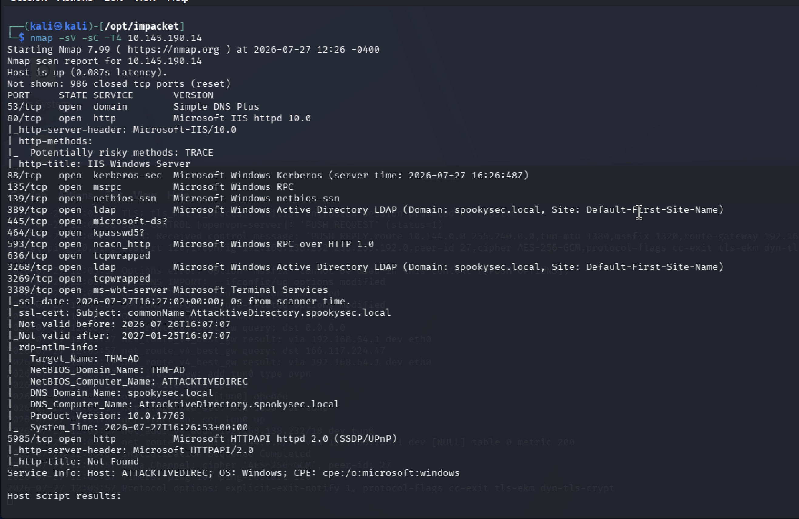

The scan returned several notable ports and services, namely LDAP and Kerberos, which heavily indicate the target machine is a domain controller. The `-sC` flag, which queries services for additional information using NSE scripts, gathered important metadata. The scripts revealed the NetBIOS domain name (`THM-AD`) and DNS domain name (`spookysec.local`), both of which proved useful during subsequent enumeration.

We then performed further enumeration using enum4linux-ng, a common tool used to gather details from Windows and Samba systems over SMB, NetBIOS and LDAP.

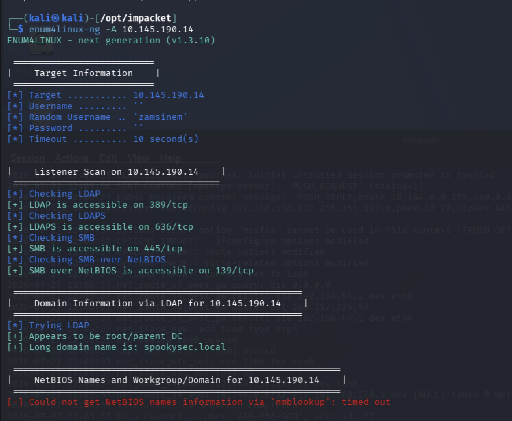

The tool provided further confirmation that the target machine was a Domain Controller

---

#### Enumeration Using Kerberos 

In our continued search for an initial set of credentials we utilized Kerbrute to find valid account usernames. In this lab, we used  Kerbrute's `userenum` and the room's provided User list to validate usernames against the domain. In short, Userenum uses Kerberos response behaviors to validate usernames.

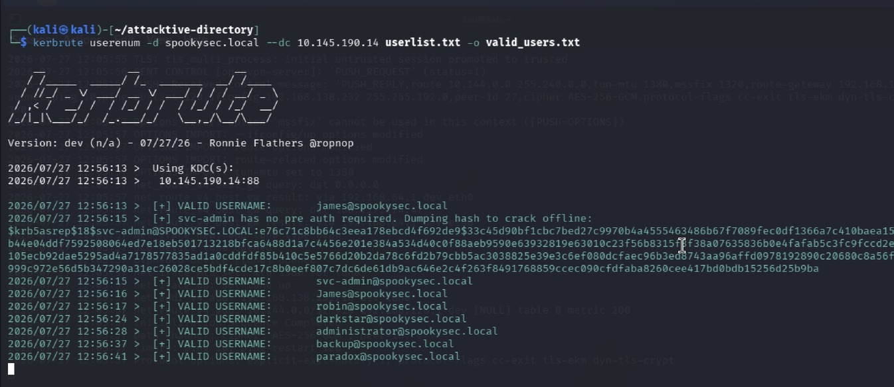

Kerbrute returned several valid usernames, but most notably `svc-admin` and it's Kerberos 5 AS-REP roast hash. Kerbrute sent an `AS-REQ` to the KDC. Because svc-admin was configured to not require Kerberos pre-authentication, the KDC immediately responded with an `AS-REP` without first verifying the knowledge of the user's password. Kerbrute extracted the returned `$krb5asrep$` hash, allowing for it to be cracked offline.

Although Kerbrute automatically retrieved the AS-REP hash during enumeration, we verified the finding using Impacket's `GetNPUsers.py`, which returned the exact same hash for the `svc-admin` account 

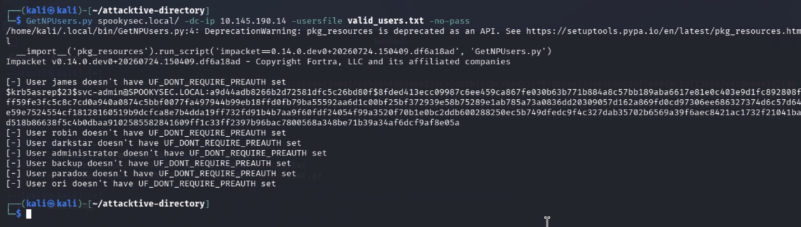

---

### Exploitation (AS-REP Roasting)

Unauthenticated AS-REP's are highly sensitive Because they are encrypted using a user's long-term key or password. We first save the returned hash into a dedicated file. 

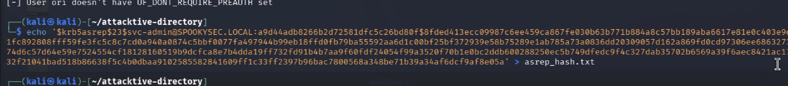

We used hashcat, a password cracking tool, and a provided Password list to recover the `svc-admin` user's password. By using the `-m 18200` it tells hashcat which algorithm the hash was produced with. 

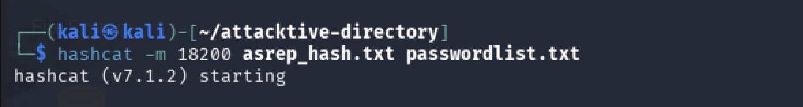

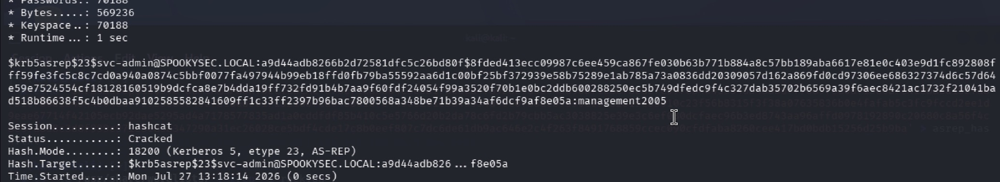

Hashcat successfully cracks the `$krb5asrep$` hash completing the credential set

- Username: svc-admin
- Password: management2005

---

### Authenticated Enumeration

Using the previously obtained credentials we attempted to enumerate any shares the domain controller might be giving out. We use the Impacket tool `smbclient.py`, which allows you to interact with remote SMB network file shares 

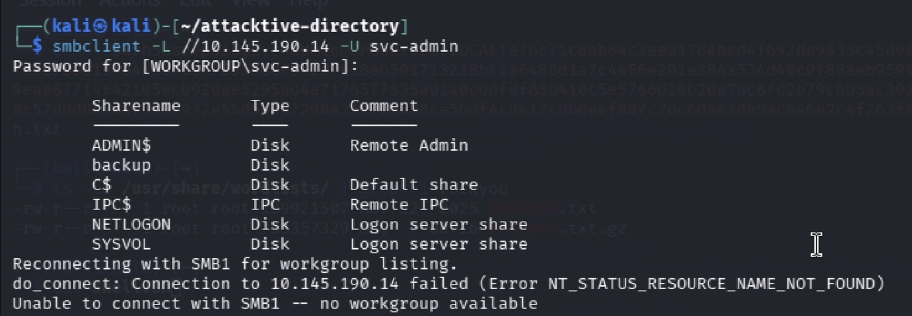

The server lists six different remote shares. After looking through the shares we find a file named `backup_credentials.txt` in the backup share.

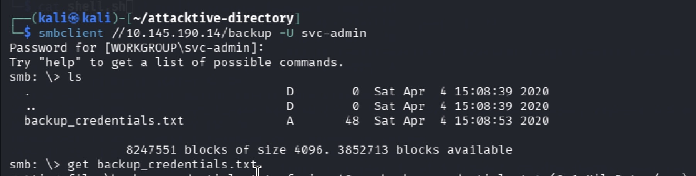

We use the `get` command to download the credential file from the remote share

Outputting the credential file to the terminal reveals the content is encoded via base 64. We can decode the encoded text using the `base64 -d` command

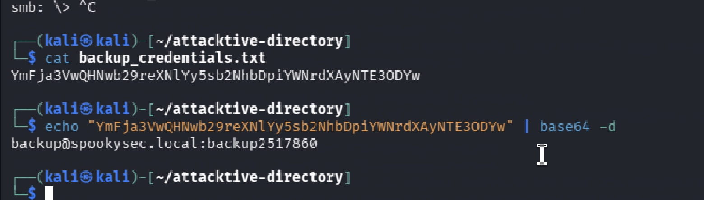

Decoded Credentials 
- Username: backup
- Password: backup2517860

### Privilege Escalation

After receiving the credentials for the `backup` account the next step is to find out the privileges of the account. ADUC Security tab for the backup account reveals two major permissions explicitly delegated 

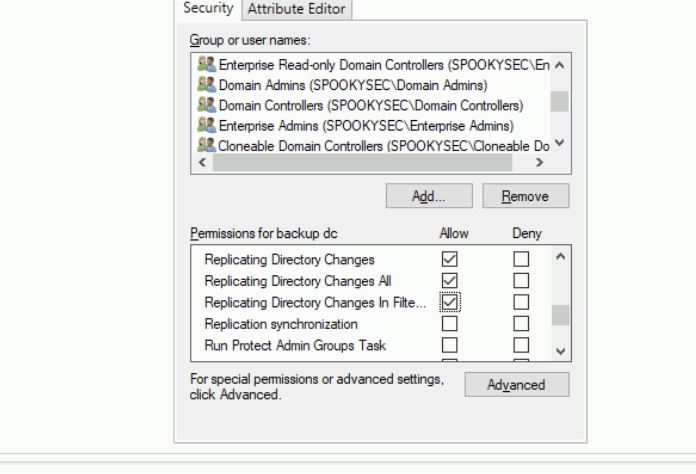

- `Replicating Directory Changes`
- `Replicating Directory Changes All`

These combined permissions grant the right to invoke DRSUAPI's replication function (DRSGETNCChanges). We used Impacket's `secretsdump.py`, which calls this function internally, to retrieve all domain credentials using only the `backup` account's credentials.

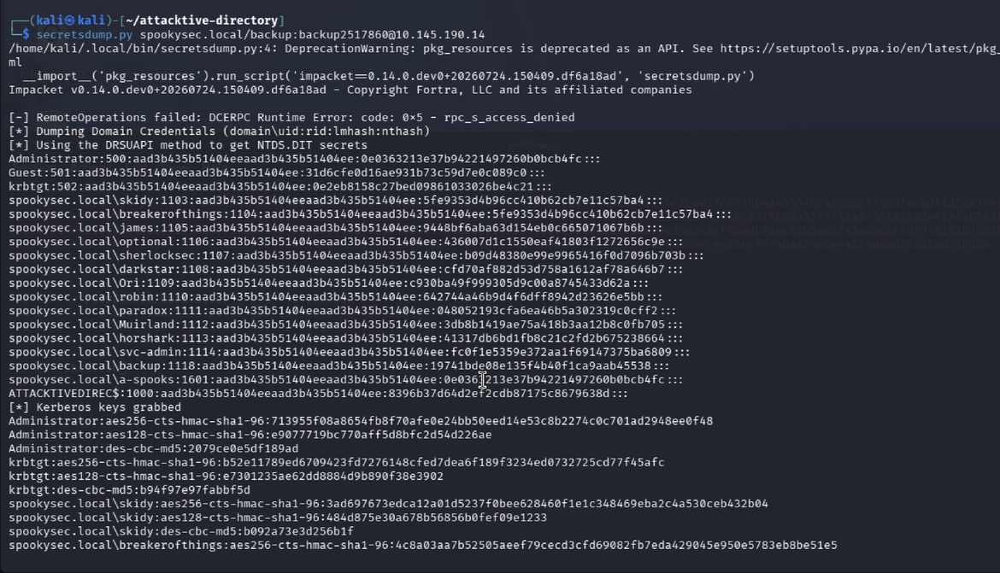

`secretsdump.py` dumped all content from NTDS.dit, including user's NTLM hashes and Kerberos long-term keys. 

### Post Exploitation (Flag Capture)

Using the previously obtained Administrator's NT hash and `evil-winrm`, we authenticated to the DC's WinRM service via pass-the-hash. 

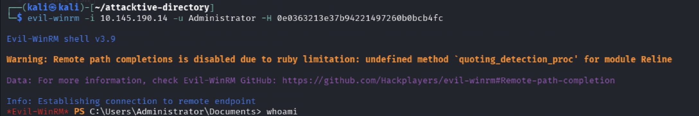

With the remote PowerShell shell we navigated through directories and obtained the flags of accounts: `svc-admin`, `backup`, and `Administrator`

**svc-admin Flag**

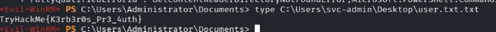

**backup Flag**

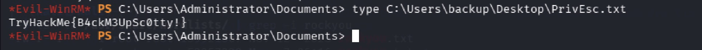

**Administrator Flag**

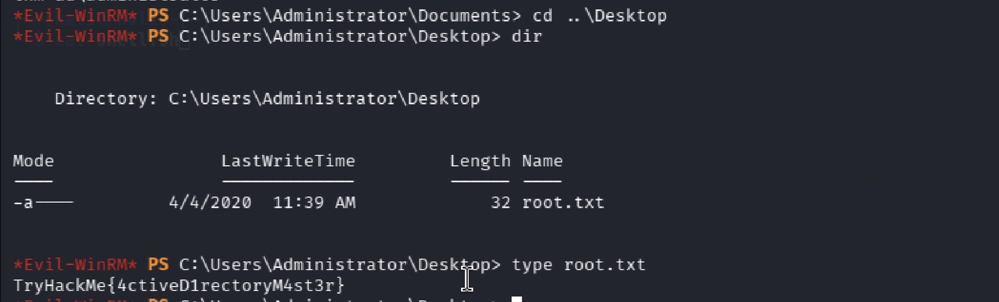

