## Target: DC01 (self-built)
## Platform: Independent lab, Azure (personal PAYG)
## Date: 07/31/26
## Difficulty: N/A — self-directed
## Tools:
- Azure Portal
- PowerShell
- Impacket (GetUserSPNs.py, psexec.py)
- Hashcat
- evil-winrm
- dig 
- nmap
- netstat
- Network Manager


### Environment & Architecture

This lab environment consists of an Active Directory Domain hosted on a 2022 Windows Server Virtual Machine in Microsoft Azure. The result is a publicly accessible domain controller secured via a source restricted NSG. 

This section covers the details of the AD lab infrastructure: 

Resource Group: rg-ad-lab, Region: East US (worked on first attempt, no fallback needed)

│

├── Virtual Network (vnet-ad-lab, 10.0.0.0/24)

│   └── Subnet "default" (10.0.0.0/24)

│       └── Windows Server 2022 Datacenter: Azure Edition (Gen2) VM — "DC01"

│              ├── Size: Standard_D2as_v7 (AMD, 2 vCPU, 8GB RAM)

│              ├── Private IP: 10.0.0.4 (static within 10.0.0.0/24)

│              ├── Public IP: DC01-public-ip, Standard SKU, static

│              │         (confirmed unchanged across full deallocate/restart cycle:

│              │         57.162.245.77)

│              ├── Security type: Trusted launch (secure boot + vTPM on)

│              └── NSG (DC01-nsg): inbound locked to home public IP only,

│                     8 custom rules (see Phase 4 — WinRM rule added later,

│                     not in original plan)

│

macOS Host (2023 MacBook Pro, Apple Silicon, 8GB RAM)

│

└── UTM (Kali-AD-Lab)

    └── Kali Linux — ARM64 build (native, no TCG emulation)

#### Firewall Rules 

To ensure the virtual network was reachable only from my machine, the NSG was configured with source-restricted inbound rules. Each rule permitted to a specific service port, with inbound access restricted only to my home IP. All other inbound traffic was denied by default.


#### Infrastructure Provisioning Challenges 

This Azure build was only achieved after two earlier infrastructure build implementations failed. (1) Azure Students free tier - Failed after student account creation restrictions. (2) Local UTM - My Mac runs ARM64 architecture and Windows Server is built natively for x86_64 architecture. This added an emulation layer dedicated to translating instructions from one architecture to another in real time. This additional translation layer is inherently slow and fragile by nature, and it produced two separate failures across two different configuration attempts (Q35 chipset + UEFI firmware, i440FX chipset + legacy BIOS)

---

### Building the Domain

To build the active Directory environment we began by promoting the virtual machine to a domain controller 
forest name: `ad.lab`
DC name: `DC01`

Verified successful domain creation on Powershell running `Get-ADDomain`


Ran diagnostics on the domain controller and encountered `SYSVOL replication problems` which pointed to a test called `DFSREVENT` that failed. I investigated the event logs to pull the log entries associated with that failure. The first entry was an error stating the DFS replication service had failed to contact Active Directory. The second entry was a warning stating the configuration failed to update. I checked the SMB shares using the `Get-SMBShare` command and found the `SYSVOL` folder there and shared correctly.


#### User Account Creation

Three user accounts `alice`, `svc_backup`, and `bob` were created to represent target users in the forthcoming attack. 


`alice`: A standard already-compromised low-privilege user who was used to initiate the kerberoasting attack

`svc_backup`: The SPN-holding account representing a fictional backup service and target of the Kerberoasting attack. 

> **NOTE**: Account configured with intentionally wordlist-crackable password `sunshine1!` (present in `rockyou.txt`) that satisfies AD default complexity.

`bob`: Roleless account created to represent the existence of  irrelevant accounts in any attack path


---

### Creating the Vulnerability

Began by registering an SPN, mapping `svc_backup` to the fictional `backup-agent` service running on the domain controller (`dc01.ad.lab`).

Completed registration and verified success using `setspn` commands.

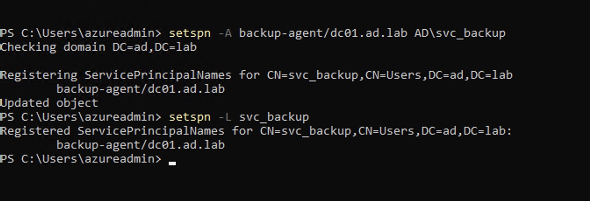

By registering `svc_backup` it transformed the account from an inactive account to a Kerberoastable one.


---

### Kali Preparation

With the target environment configured, I prepared the Kali Linux system that would be used to perform the attack. 
I started by installing the necessary tools 

```bash
sudo apt install -y krb5-user hashcat smbclient ldap-utils
```

DNS was configured via NetworkManager to avoid silent overwrites on `/etc/resolv.conf`. 

```bash
sudo nmcli con mod "Wired connection 1" ipv4.dns "57.162.245.77"
sudo nmcli con mod "Wired connection 1" ipv4.ignore-auto-dns yes
sudo nmcli con up "Wired connection 1”
```

The first command ensures that whenever Kali needs to resolve names it asks our domain controller instead of a public DNS server. The second command ensures that DHCP doesn't overwrite our manually configured DNS server. The third command applies the changes by reconnecting the network connection using the new settings.

Verified with: 

```bash
dig ad.lab @57.162.245.77
```


#### Establishing a Diagnostic Baseline

Before using Impacket for Kerberos Authentication I wanted to establish a diagnostic baseline using native Kerberos tooling. This way, if Impacket's Kerberos implementation failed I would know that the problem was specific to Impacket rather than the environment.

In order to interact with the domain controller's Kerberos service the Kali machine needs the necessary tools. `krb5-user` installs MIT Kerberos client tools, which we can use to communicate with the DC01's domain controller. In our case, the tools `kinit` and `klist` allow us to request a Ticket Granting Ticket (TGT) and view the ticket respectively. 

After installing `krb5-user` I examined the contents of `/etc/krb5.conf`, a configuration file that maps a Kerberos realm name to its authoritative KDC. A Kerberos Realm is an administrative boundary that defines the scope of authority of a KDC. The file was populated with stock MIT Kerberos defaults, such as (`Athena.MIT.EDU`). I deleted all of the irrelevant entries, definied the realm name, and mapped the KDC to my domain controller's IP address. 

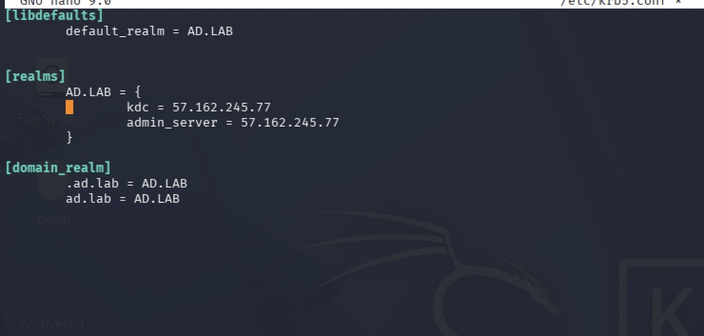

With `krb5.conf` corrected, I requesting a TGT using Alice's account and the `kinit` tool. Using Alice's known password I successfully authenticated. To confirm the existence of the TGT I used the `klist` command which displays all active Kerberos tickets for the current user session. `klist` displayed a valid `krbtgt/AD.LAD@AD.LAB` entry. This confirmed not only successful DNS resolution and network reachability but also provided credentials. 
 

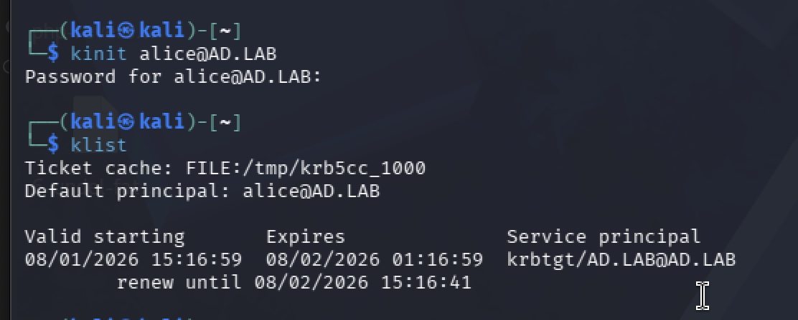

> It is worth noting that this TGT played no part in the actual kerberoasting attack - `GetUserSPNs.py` performed its own independant authentication using Alice's password directly.

---

### Attack Execution

After establishing a diagnostic baseline it was time to perform the extraction command using Impacket's `GetUserSPNs.py`. This Impacket tool finds user accounts with SPNs and requests service tickets (TGSs) for them.

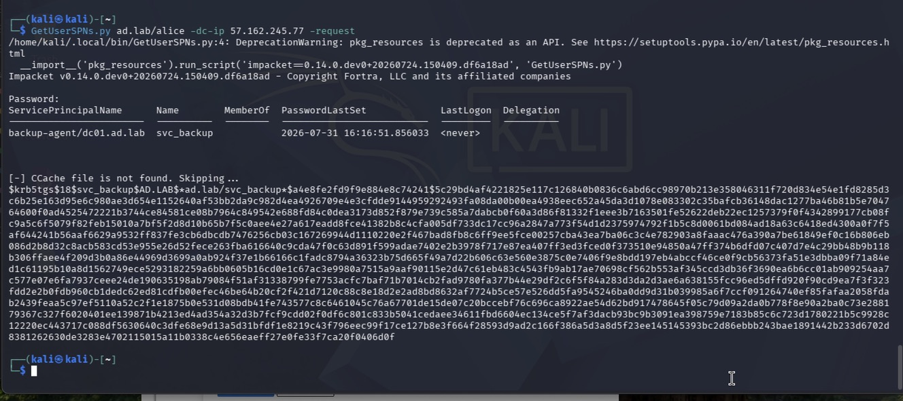

The extraction succeeded cleanly returning the `$krb5tgs$` hash for `svc_backup`. 


#### Cracking

With the `$krb5tgs$` hash in possesion it was time to crack it using `hashcat`. 

> The extracted hash began `$krb5tgs$18$...` — etype 18 (AES256), not RC4 (my original plan). This is significantly more expensive to crack, which led to a slight deviation in execution

After running 

```bash
hashcat -m 19700 kerberoast_hash.txt /usr/share/wordlists/rockyou.txt
```
A full `rockyou.txt` was projected to complete in ~8 hours. To combat time constraints I identified the password's placement using the `grep` command and created a more practical wordlist derived from the contents of `rockyou.txt`. 

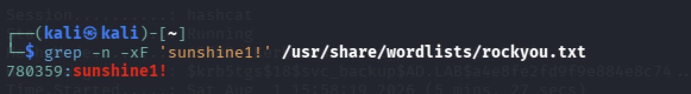


**Practical Wordlist**

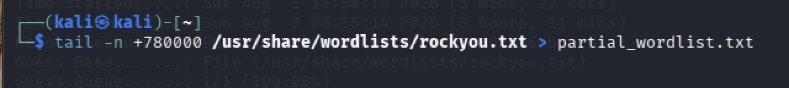

Ran hashcat against the wordlist using mode `19700` 

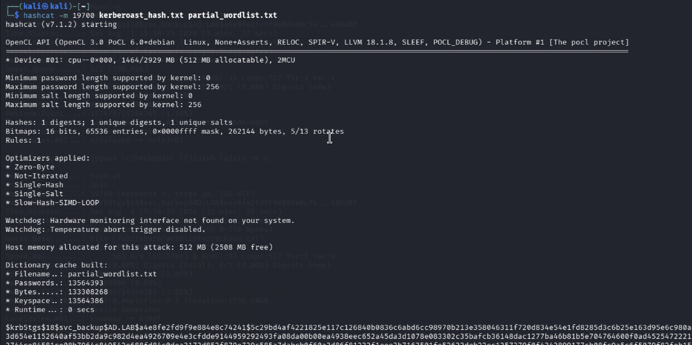

Hashcat successfully cracked `$krb5tgs$` revealing `svc_backup` password

---

### Network Troubleshooting (445/5985)

#### SMB troubleshoot 

After successfully obtaining `svc_backup` credentials I attempted to remotely execute commands on the domain controller using `psexec.py`. This Impacket tool uses SMB to remotely execute commands on a Windows machine. 

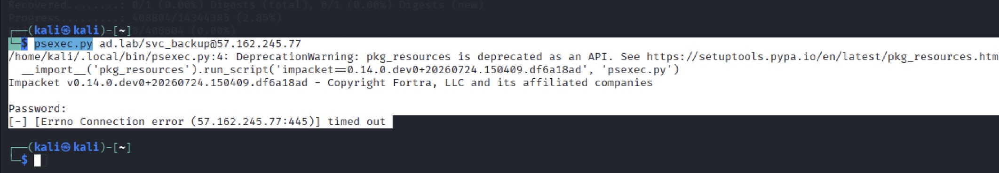

The first attempt failed due to a connection timeout indicating that the TCP handshake to port 445 never completed. To investigate this I conducted a network scan using `nmap` on the domain controller.

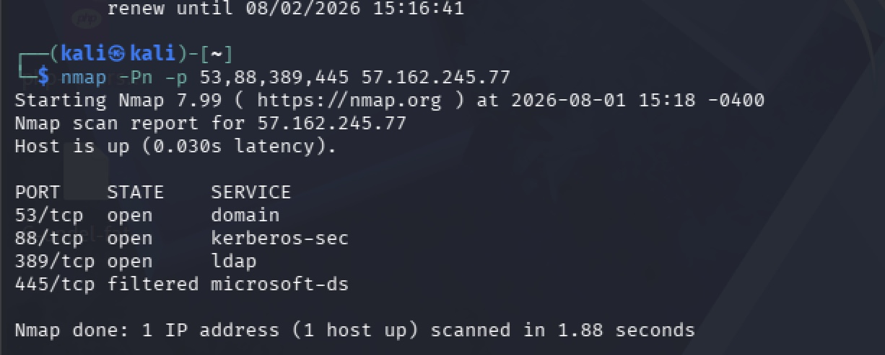

The port state of SMB on the domain controller was filtered, meaning `nmap` couldn't determine whether the port was open or closed because it wasn't accessible. I investigated further on the DC: `Get-NetConnectionProfile` revealed the NIC was classified as `Public`, while the `File and Printer Sharing (SMB-In)` rule was scoped to `Domain, Private` only. This meant the rule never actually applied to this connection, despite showing `Enabled: True`. I corrected the scope with `Set-NetFirewallRule -Profile Any`, which did not resolve the timeout.

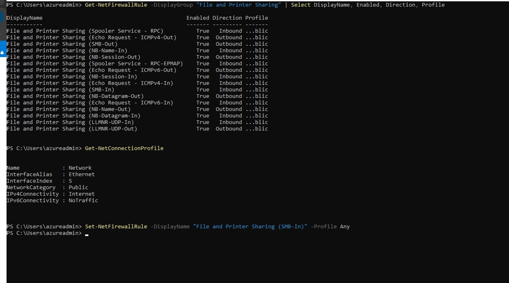


After correcting the firewall rule the timeout was still unresolved. To investigate whether the service was disabled or not I checked the `LanmanServer`, which is a service responsible for implementing SMB server functionality. `Get-Service LanmanServer` confirmed the service was running. `Get-NetTCPConnection` showed that SMB is running, but Windows wasn't listening for IPv4 connections. I then checked the SMB server configuration and found no obvious problems 

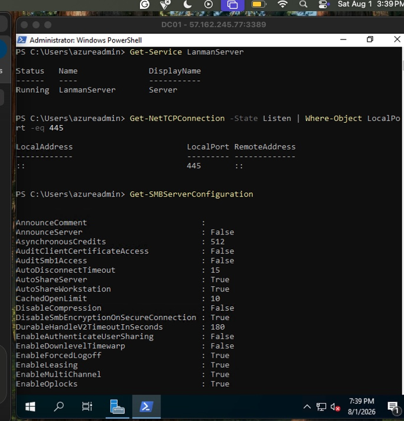

I continued by resolving the unexpected IPv4 problem by running `netstat -an | findstr :445`. This revealed listeners on both IPv4 and IPv6.

With every host-side layer confirmed correct, the timeout persisted, indicating the SMB traffic was blocked somewhere outside my control. With that considered, I pivoted to WinRM (port 5985) via `evil-winrm`, which offered an alternate path to remote execution. 


#### WinRM Troubleshooting

Enabling a remote PowerShell required two things on DC01: a new NSG rule permitting inbound 5985 traffic from my home IP, and the WinRM listener itself.

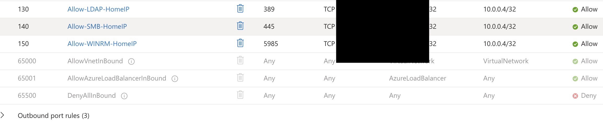

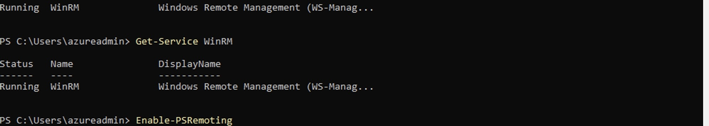

After changing the NSG rules and enabling WinRM I ran an nmap scan on my Kali machine

```bash
nmap -Pn -p445,5985 57.162.245.77
```

Port 5985 experienced the same silent timeout observed on port 445. This indicated that something between the Kali machine and DC01 was filtering the connections. 

#### Temp Hotspot & Network-level Block Bypass

After both SMB and WinRM failed identically despite host-side layer confirmation, the only explanation was a network-level block happening outside of Azure. I assumed that the traffic was being blocked at either my home ISP or gateway. In order to test this I needed to obtain a different public IP from a different provider. I connected my computer to my phone's personal hotspot, giving Kali a completely different public IP. Before testing the new port state, I temporarily reconfigured the NSG rules to allow inbound connections from the hotspot's IP.

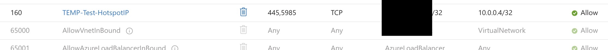

> Removed immediately after testing to avoid unecessary exposure on the DC

After reconfiguring the NSG rules, I ran a `nmap` scan for ports 445 and 5985 on DC01.


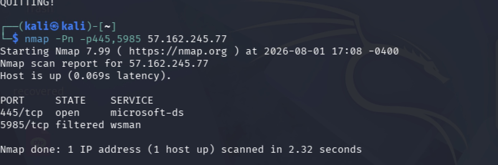

This time, port 445 showed open, meaning the connection actually reached DC01 this time, unlike every other previousw attempt before.

---

### Privilege Boundary Finding

With the network-level block bypassed using the hotspot, I attempted to achieve remote execution using `psexec.py`.

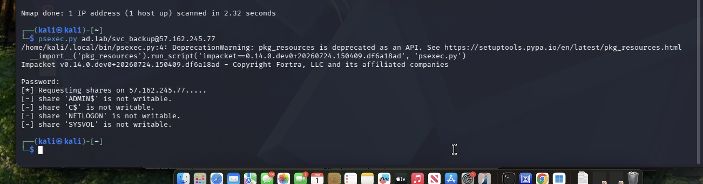

`psexec.py` successfully reached DC01 and authenticated as `svc_backup` with no errors. This confirmed that the previously cracked credentials were indeed valid. Despite authentication, `psexec.py` failed to find a writable share.

`psexec.py` requires write permissions on administrative shares in order to complete code execution. That is because its method of code execution is (1) Upload executable (2) register it as a Windows service (3) Start the service. `svc_backup` did not have local administrative privileges on DC01 as it was a standard service account. 


