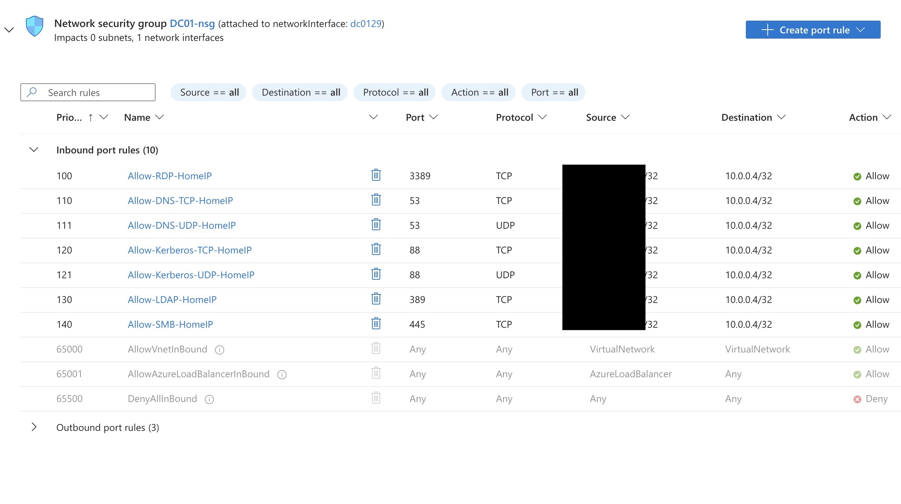
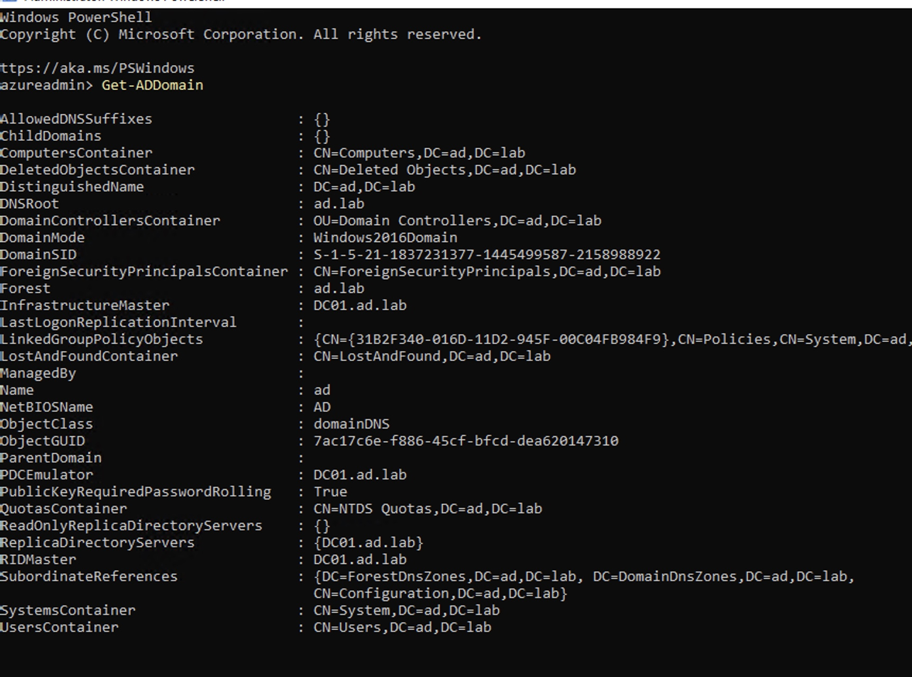
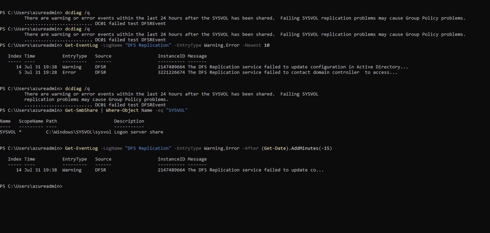
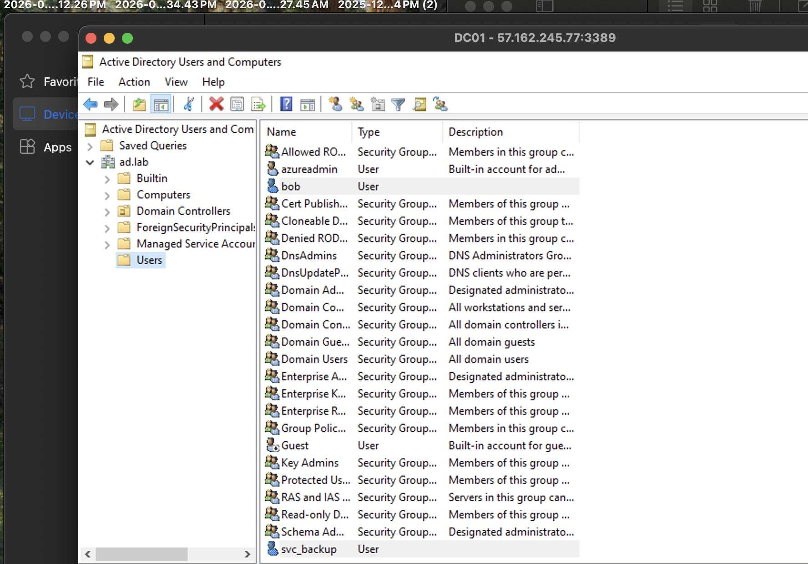

## Target: DC01 (self-built)
## Platform: Independent lab, Azure (personal PAYG)
## Date:
## Difficulty: N/A — self-directed
## Tools:

### Environment & Architecture

This lab environment consists of a Active Directory Domain hosted on a 2022 Windows Server Virtual Machine in Microsoft Azure. The result is a publically accessible domain controller secured via a source restricted NSG. 

This section covers the details of the AD lab infastructure: 

Resource Group: rg-ad-lab, Region: East US (worked on first attempt, no fallback needed)

│

├── Virtual Network (vnet-ad-lab, 10.0.0.0/24)

│   └── Subnet "default" (10.0.0.0/24)

│       └── Windows Server 2022 Datacenter: Azure Edition (Gen2) VM — "DC01"

│              ├── Size: Standard_D2as_v7 (AMD, 2 vCPU, 8GB RAM)

│              ├── Private IP: 10.0.0.4 (static within 10.0.0.0/24)

│              ├── Public IP: DC01-public-ip, Standard SKU, static

│              │         (confirmed unchanged across full deallocate/restart cycle:

│              │         57.162.245.77)

│              ├── Security type: Trusted launch (secure boot + vTPM on)

│              └── NSG (DC01-nsg): inbound locked to home public IP only,

│                     8 custom rules (see Phase 4 — WinRM rule added later,

│                     not in original plan)

│

macOS Host (2023 MacBook Pro, Apple Silicon, 8GB RAM)

│

└── UTM (Kali-AD-Lab)

    └── Kali Linux — ARM64 build (native, no TCG emulation)

#### Firewall Rules 

To ensure the virtual network was reachable only from my machine, the NSG was configured with source-restricted inbound rules. Each rule permitted to a specific service port, with inbound access restricted only to my home IP. All other inbound traffic was denied by default.

#### Infrastructure Provisioning Challenges 

This Azure build was only reached after two earlier infrastructure build implementations failed. (1) Azure Students free tier - Failed after student account creation restrictions. (2) Local UTM - My Mac runs ARM64 architecture and Windows Server is built natively for x86_64 architecture. This added an emulation layer dedicated to translating instructions from one architecture to another in real time. This additional translation layer is inherently slow and fragile by nature, and it produced two separate failures across two different configuration attempts (Q35 chipset + UEFI firmware, i440FX chipset + legacy BIOS)

### Building the Domain

To build the active Directory environment we began by promoting the virtual machine to a domain controller 
forest name: `ad.lab`
DC name: `DC01`

Verified successful domain creation on Powershell running `Get-ADDomain`

Ran diagnostics on the domain controller and encountered `SYSVOL replication problems` which pointed to a test called `DFSREVENT` that failed. I investigated the event logs to pull the log entires associated with that failure. The first entry was an error stating the DFS replication service had failed to contact Active Directory. The second entry was a warning stating the configuration failed to update. I checked the SMB shares using the `Get-SMBShare` command and found the `SYSVOL` folder there and shared correctly.

#### User Account Creation

Three user accounts `alice`, `svc_backup`, and `bob` were created to represent target users in the forthcoming attack. 

- `alice`: A standard already-compromised low-privilege user who was used to initiate the kerberoasting attack

- `svc_backup`: The SPN-holding account representing a fictional back up service and target of the Kerberoasting attack

- `bob`: Roleless account created to represent the existence of  irrelevant accounts in any attack path

### Creating the Vulnerability

### Kali Preparation

### Attack Execution

### Network Troubleshooting (445/5985)

### Privilege Boundary Finding

